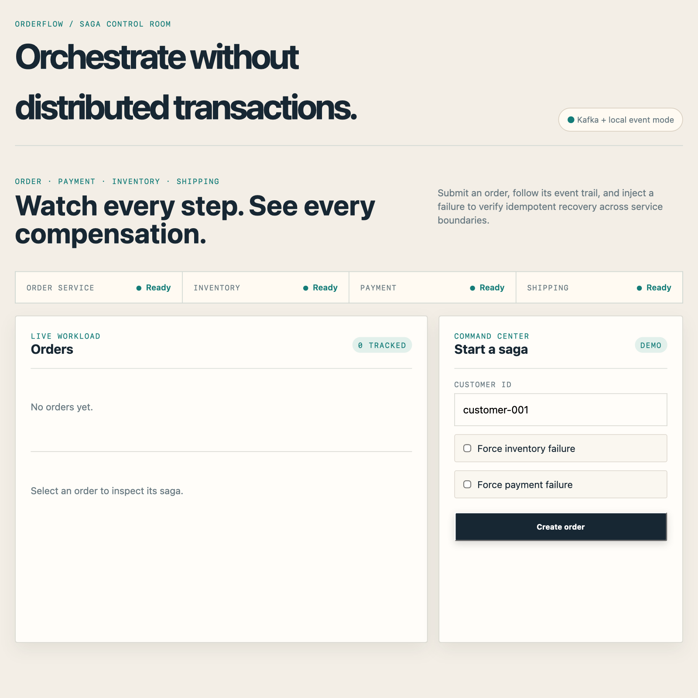
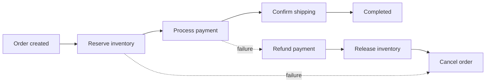

# Order Orchestration System

An event-driven order workflow demonstrating the Saga pattern across Order, Inventory, Payment, and Shipping service boundaries. The Spring Boot process hosts the services locally; Kafka topics model the production communication boundaries.

## UI Preview



## Run it

With Java 25 and Maven 3.9:

```bash
mvn spring-boot:run
```

Open `http://localhost:8080`.

The default development profile includes a local Saga fallback, so the dashboard can complete success and compensation flows without Kafka. When Kafka is available, the same service boundaries communicate through the configured topics.

To run the Kafka-backed flow with Docker:

To start the supporting deployment topology with Kafka in KRaft mode, PostgreSQL 16, and Kafka UI:

```bash
docker compose up --build
```

Kafka UI is available at `http://localhost:8090`.

## Architecture

- **Order service** accepts commands and persists order state in SQL.
- **Inventory service** reserves or releases stock from Kafka events.
- **Payment service** authorizes or refunds payment from Kafka events.
- **Shipping service** creates a shipment after payment authorization.
- **Saga coordinator** records state transitions and publishes compensating commands.
- **Idempotency store** persists consumer/event keys so duplicate Kafka deliveries are safe.
- **Retry executor** retries transient service work three times before failure is emitted.

The local app uses an H2 SQL database by default. Set `KAFKA_BOOTSTRAP_SERVERS` to point at another Kafka broker.

For a Kafka-only deployment, disable the local fallback with `app.saga.local-fallback=false`.

Kafka topics:

```text
order.events
inventory.events
payment.events
shipping.events
```

## Saga flow



The coordinator owns the state transition history. A failed inventory step cancels immediately. A failed payment step refunds payment and releases the prior inventory reservation before cancelling the order. The dashboard shows the persisted event trail and provides failure switches for both compensation paths.

## Project shape

The runnable vertical slice keeps the service boundaries in one Spring Boot process for local development. Each boundary has its own Kafka consumer group and can be extracted into an independently deployable service without changing the event contracts.